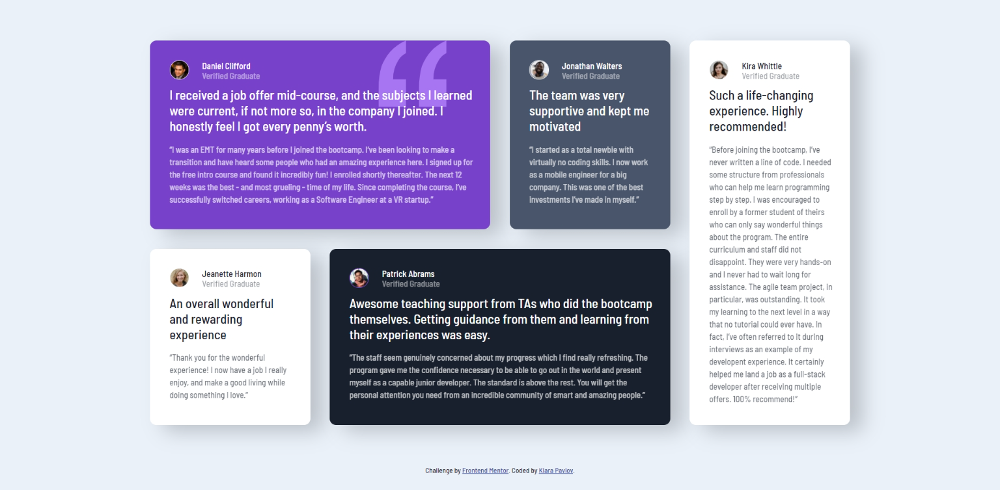

# Frontend Mentor - Testimonials grid section solution

This is a solution to the [Testimonials grid section challenge on Frontend Mentor](https://www.frontendmentor.io/challenges/testimonials-grid-section-Nnw6J7Un7).Frontend Mentor challenges help you improve your coding skills by building realistic projects.

## Table of contents

- [Overview](#overview)
  - [The challenge](#the-challenge)
  - [Screenshots](#screenshots)
  - [Links](#links)
- [My process](#my-process)
  - [Built with](#built-with)
- [Author](#author)

## Overview

### The challenge

Users should be able to:

- View the optimal layout for the site depending on their device's screen size

### Screenshots

### Links

- Solution URL: [https://github.com/klara-pavlov/testimonials-grid-section-solution](https://github.com/klara-pavlov/testimonials-grid-section-solution)
- Live Site URL: [https://testimonials-grid-section-solution-klara-pavlov-2021.netlify.app/](https://testimonials-grid-section-solution-klara-pavlov-2021.netlify.app/)

## My process

### Built with

- Semantic HTML5 markup
- CSS custom properties
- Flexbox
- CSS Grid

## Author

- Frontend Mentor - [@klara-pavlov](https://www.frontendmentor.io/profile/yourusername)
- GitHub - [@klara-pavlov](https://github.com/klara-pavlov)
- LinkedIn - [@klara-pavlov](https://www.linkedin.com/in/klara-pavlov/)
- Instagram - [@klara.pavlov](https://www.instagram.com/klara.pavlov/)
